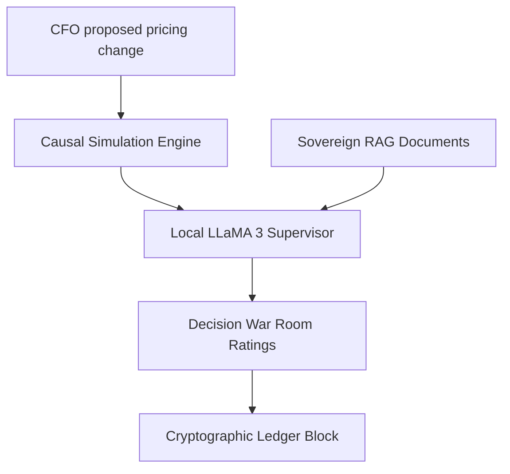

# ⚡ Financial Time Machine (FTM) v2.0.0
> **Autonomous Causal Decision Twin for Enterprise Finance**

Financial Time Machine (FTM) is a secure, local-first enterprise platform designed for Chief Financial Officers (CFOs), executives, and auditors to simulate, evaluate, and log major corporate decisions (e.g., catalog pricing hikes, logistical surcharge modifications, or operational OpEx reallocations) in simulated time first.

Pushed live on remote: `https://github.com/jaimiltrived/BUILDTHON-.git`

---

## 🛡️ Four Pillars of FTM Architecture



### 1. Multi-Scenario Causal Sandbox
Test pricing changes (from +1% to +30%) against real-world customer price elasticities. Instantly yields **Pessimistic**, **Base Expected**, and **Optimistic** Net Revenue, operating profit margins, and merchant churn rates.

### 2. Local-First RAG Memory (Sovereign Ingestion)
Ingest corporate PDF reports, CSV logs, TXT documents, and JSON streams. An in-memory keyword-scoring index retrieves relevant paragraphs locally and grounds the AI supervisor replies without sending sensitive company financials to external APIs.

### 3. Cryptographic Decision Ledger
Every simulation scenario, multi-agent recommendation, and board approval is logged sequentially to a tamper-evident audit index secured with SHA-256 blocks for compliance auditing.

### 4. Live Multi-Agent debater Loop
When a simulation is run, multiple local specialist agents (Financial Observer, Risk Guardian, Competitor Benchmarker) debate the proposal under the guidance of the LLaMA 3 Supervisor Agent.

---

## 📂 Project Directory Structure

```
├── backend/                  # FastAPI Application
│   ├── app/
│   │   ├── agents/          # Multi-Agent prompt templates & Ollama controllers
│   │   ├── analytics/       # Risk scoring & strategy evaluation engines
│   │   ├── api/             # REST endpoints (auth, simulations, RAG documents, etc.)
│   │   ├── models/          # Database schemas (Document, Order, Customer, User)
│   │   └── simulation/      # Causal elasticity calculations
│   └── main.py              # Application entrypoint & table auto-creation
├── frontend/                 # Vite + React + TypeScript App
│   ├── src/
│   │   ├── components/      # UI components (LandingPage, AIChat, WarRoom, etc.)
│   │   ├── contexts/        # Auth credential contexts
│   │   └── lib/             # API client & React Query status selectors
```

---

## 🚀 Setup & Installation

### Prerequisite
* **Ollama**: Download and install [Ollama](https://ollama.com/) locally. Run `ollama pull llama3` to fetch the model core.

### 1. Backend Service
1. Navigate to the backend directory:
   ```bash
   cd backend
   ```
2. Create and activate a Python virtual environment:
   ```bash
   python -m venv venv
   source venv/bin/activate  # On Windows: venv\Scripts\activate
   ```
3. Install dependencies (including `pypdf` for RAG PDF scanning):
   ```bash
   pip install -r requirements.txt
   ```
4. Copy the environment config and adjust settings:
   ```bash
   cp .env.example .env
   ```
   *Note: Ensure `API_PORT=8001` is configured to match the frontend API Client.*
5. Run the DB seeding script (creates demo users & sqlite db):
   ```bash
   python scripts/seed_demo_users.py
   ```
6. Start the dev server:
   ```bash
   python -m uvicorn main:app --port 8001 --host 127.0.0.1
   ```

### 2. Frontend Application
1. Navigate to the frontend directory:
   ```bash
   cd ../frontend
   ```
2. Install npm dependencies:
   ```bash
   npm install
   ```
3. Start the Vite hot-reloading dev server:
   ```bash
   npm run dev
   ```
   *Note: If port 5173 is in use, Vite will automatically run on http://localhost:5174.*

---

## 🎭 Role Matrix & Seeded Logins

FTM uses role-based access control (RBAC) to enforce security partitions:

| Persona | Seeded Email | Password | Allowed Capabilities |
| :--- | :--- | :--- | :--- |
| **CFO** | `cfo@nova.com` | `nova123` | Create war rooms, trigger simulations, upload RAG memory |
| **Executive** | `exec@nova.com` | `nova123` | View pending decisions, approve/sign off on price proposals |
| **Auditor** | `auditor@nova.com` | `nova123` | Read-only ledger audits, verify SHA-256 block chain integrity |
| **Business Analyst**| `analyst@nova.com` | `nova123` | Run what-if parameters, check risk metrics (no war rooms) |
| **Org Admin** | `admin@nova.com` | `admin123` | Upload new master transaction batches, manage user seats |
| **Super Admin** | `superadmin@ftm.com`| `super123` | Fleet configurations, edit model parameters |

---

## 📈 Key UI Visualizations

1. **Interactive Sandbox Previews**: Check price margins using live sliders on the unauthenticated marketing landing page.
2. **Dynamic Chart Ranges**: Switch the main Executive Dashboard graph between:
   * **12 Months**: Standard database monthly trends.
   * **30 Days**: Daily transaction volume.
   * **Last 2 Days**: Hour-by-hour transaction peak metrics.
3. **RAG Context Panel**: In the **AI Copilot** page, drag and drop documents on the right panel to ground the LLaMA 3 conversational assistant in real-time.
