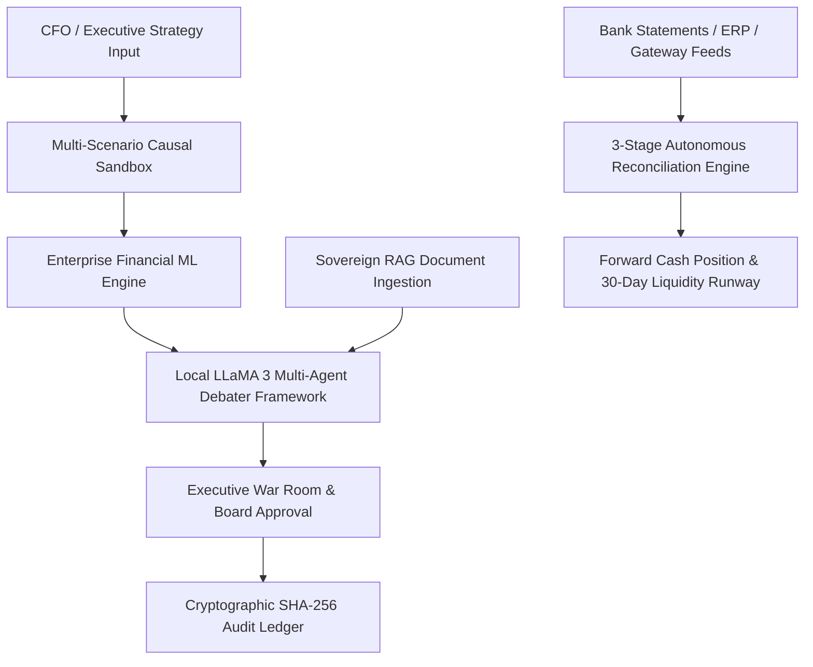

# ⚡ Financial Time Machine (FTM) v2.0.0
> **Autonomous Causal Decision Twin, Multi-Source Reconciliation & Predictive ML Platform for Enterprise Finance**

[](https://github.com/jaimiltrived/BUILDTHON-)
[](https://www.python.org/)
[](https://fastapi.tiangolo.com/)
[](https://reactjs.org/)
[](https://www.typescriptlang.org/)
[](https://vitejs.dev/)
[](https://ollama.com/)
[](https://owasp.org/)
[](LICENSE)

**Financial Time Machine (FTM)** is a secure, local-first enterprise decision simulation, multi-source financial reconciliation, and predictive intelligence platform engineered for Chief Financial Officers (CFOs), financial controllers, risk officers, and compliance auditors. FTM enables organizations to simulate strategic pricing changes, evaluate cross-functional business impacts, execute high-throughput multi-source financial reconciliations, run machine learning predictive models, and log every executive decision to an immutable cryptographic SHA-256 audit ledger—all completely local and sovereign.

Pushed live on remote repository: `https://github.com/jaimiltrived/BUILDTHON-.git`

---

## 🌟 Key Platform Features & Modules



### 1. ⚡ Multi-Scenario Causal Elasticity Sandbox
- **Interactive Price Sensitivity Tuning**: Test catalog pricing modifications (from -10% to +30%) against empirical customer price elasticity profiles.
- **Three-Tier Scenario Forecasting**: Instantly generates **Pessimistic**, **Base Expected**, and **Optimistic** revenue forecasts, operating profit margins (EBITDA), net cash flow deltas, and merchant churn rates.
- **Preset Strategy Workbench**: One-click quick strategy presets including *Conservative 2% Margin Bump*, *Aggressive 15% Expansion*, and *Defensive Volume Retain*.

### 2. 🏦 Track 04: Autonomous 3-Stage Financial Reconciliation Engine
- **Multi-Source Data Ingestion**: Ingests and processes 65-record synthetic batches across Bank Statements (HDFC Corp), ERP Invoices, and Payment Gateway Payout Feeds (RazorpayX, Stripe India, SWIFT Wires).
- **Stage 1 (Exact Match - 100% Confidence)**: Deterministic UTR payment reference & exact amount matching ($\Delta = ₹0.00$).
- **Stage 2 (Heuristic Gateway MDR Fee Match - 98% Confidence)**: Fee-tolerant matching accounting for contractual Merchant Discount Rates (MDR 1.8% to 2.2%):
  $$\text{Net Payout} = \text{Gross Invoice Amount} - \text{Gateway MDR Fee}$$
- **Stage 3 (Cognitive Discrepancy Analysis)**: Isolated non-cherry-picked real-world exceptions with LLaMA 3 AI triage recommendations:
  - **Unidentified Bank Credit (Ghost Wires)**: Direct wire without matching customer ID; flags for Treasury LEI outreach.
  - **Excessive Gateway Fee Overcharge**: Gateway charged 4.66% vs 1.8% SLA; files automated RazorpayX billing dispute claim for ₹3,376 recovery.
  - **Ambiguous Split Settlement**: Lump-sum bank credit matching sum of multiple open orders ($\text{INV-1062A} + \text{INV-1062B}$).
  - **Tax TDS Withholding Discrepancy**: Customer withheld 5% TDS vs statutory 1% Section 194C requirement; issues Form 16A demand note.
  - **Chargeback Dispute Clawback**: Unilateral gateway debit clawback; triggers Risk Center representment package.
  - **Foreign Currency FX Slippage**: SWIFT wire conversion rate delta ($81.20/\$ vs $83.50/\$); auto-books loss to Realized FX Loss P&L line item.
- **Forward Cash Runway Forecasting**: Computes 30-day liquidity projections considering verified reconciled cash positions (₹2.48+ Cr) vs unapplied liability exposure.

### 3. 📊 Enterprise Financial Machine Learning Engine
- **Random Forest Cohort Churn Predictor**: 120-tree ensemble classifier modeling customer recency, order velocity, monetary AOV, service complaints, refund ratios, and price sensitivity ($ROC\text{-}AUC \ge 0.94$).
- **Gradient Boosting Profit Frontier Optimizer**: Solves the continuous mathematical profit-maximization curve across price shifts:
  $$\text{Profit}(\Delta P) = \text{Revenue}_0 (1 + \Delta P) \cdot f_{\text{elasticity}}(\Delta P) - \text{Costs}(\Delta P)$$
  Identifies the exact mathematical apex $\Delta P^*$ to maximize operating EBITDA before churn degradation sets in.
- **Ridge Auto-Regressive Cash Flow Forecaster**: Delivers 90-day forward liquidity predictions with 95% confidence intervals.

### 4. 🤖 Local-First Multi-Agent Debater & Sovereign RAG
- **Consensus Multi-Agent Framework**: **Financial Observer**, **Risk Guardian**, and **Competitor Benchmarker** debate proposals under the guidance of a local **LLaMA 3 Supervisor Agent**.
- **In-Memory Sovereign RAG**: Ingest PDF reports, CSV logs, TXT documents, and JSON streams into an in-memory TF-IDF context retriever. Zero telemetry—sensitive financial data never leaves your infrastructure.

### 5. 🛡️ Cryptographic SHA-256 Decision Ledger
- **Tamper-Evident Block Chain**: Every simulation run, multi-agent debater transcript, and executive sign-off is hashed sequentially using SHA-256:
  $$H_i = \text{SHA256}(H_{i-1} \parallel \text{Timestamp} \parallel \text{ProposalID} \parallel \text{Signatures})$$
- Provides compliance auditors with immutable cryptographic audit trails for SOX, ISO 27001, and financial governance compliance checks.

### 6. 🎨 Enterprise UI & Design System
- Dark mode glassmorphism UI, glowing card animations, tech-grid canvas overlay, Recharts financial data visualization, interactive tabs, and responsive executive war room.

---

## 🎭 Role-Based Access Control (RBAC) Matrix

FTM enforces strict role permissions across enterprise personas:

| Persona Role | Seeded Email | Password | Access Rights & Allowed Capabilities |
| :--- | :--- | :--- | :--- |
| **CFO** | `cfo@nova.com` | `nova123` | Full strategic access: Create war rooms, trigger simulations, upload RAG memory, execute reconciliation |
| **Executive** | `exec@nova.com` | `nova123` | Executive dashboard, pending decision approvals, board sign-offs, high-level financial metrics |
| **Auditor** | `auditor@nova.com` | `nova123` | Read-only access to cryptographic SHA-256 ledger block chain, audit log verification |
| **Business Analyst**| `analyst@nova.com` | `nova123` | Parameter what-if sandbox, risk scoring, ML profit frontier exploration (no war room creation) |
| **Org Admin** | `admin@nova.com` | `admin123` | Ingest master transaction batches, manage user seats, organization profile settings |
| **Super Admin** | `superadmin@ftm.com`| `super123` | Fleet control, ML model re-training, system-wide configuration settings |

---

## 📂 Complete Project Directory Structure

```
├── backend/                              # FastAPI Application Core
│   ├── app/
│   │   ├── agents/                      # Multi-Agent prompt templates & Ollama controllers
│   │   │   └── supervisor.py            # LLaMA 3 Supervisor & Debater Loop Controller
│   │   ├── analytics/                   # Risk scoring & 3-Stage reconciliation engine
│   │   │   └── reconciliation_engine.py # Multi-source matching & cash forecast logic
│   │   ├── api/                         # REST API Routers & Middleware
│   │   │   ├── routers/                 # 14 FastAPI Router Modules
│   │   │   │   ├── ai.py                # AI Copilot & agent debate endpoints
│   │   │   │   ├── audit.py             # Activity log audit stream endpoints
│   │   │   │   ├── auth.py              # JWT authentication & profile endpoints
│   │   │   │   ├── documents.py         # File ingestion & RAG context endpoints
│   │   │   │   ├── financial.py         # KPI summary & financial data endpoints
│   │   │   │   ├── ledger.py            # Cryptographic SHA-256 ledger endpoints
│   │   │   │   ├── memory.py            # RAG memory document upload endpoints
│   │   │   │   ├── ml_models.py         # Random Forest & GBDT ML endpoints
│   │   │   │   ├── organizations.py     # Organization profile management
│   │   │   │   ├── reconciliation.py    # 3-Stage reconciliation & cash forecast API
│   │   │   │   ├── risk.py              # Risk scoring & margin metrics
│   │   │   │   ├── simulations.py       # Causal price elasticity sandbox API
│   │   │   │   ├── users.py             # User seat management & RBAC endpoints
│   │   │   │   └── war_room.py          # Executive war room proposal API
│   │   │   ├── deps.py                  # OAuth2 / JWT authentication injectors
│   │   │   └── org_utils.py             # Multi-tenant organization scoping helpers
│   │   ├── core/                        # System configuration & security utilities
│   │   │   ├── config.py                # Pydantic Settings & environment variables
│   │   │   ├── database.py              # SQLAlchemy DB engine & session factory
│   │   │   └── security.py              # Password hashing & JWT token generation
│   │   ├── ml/                          # Enterprise Financial ML Engine
│   │   │   └── financial_ml_engine.py   # RandomForest, GradientBoosting & Ridge models
│   │   ├── models/                      # Database Schemas & Pydantic Data Models
│   │   │   ├── document.py              # RAG document models
│   │   │   ├── financial.py             # Financial transaction models
│   │   │   ├── ledger.py                # Cryptographic audit block models
│   │   │   ├── organization.py          # Organization models
│   │   │   └── user.py                  # User & Role models
│   │   └── simulation/                  # Causal elasticity calculation engines
│   ├── tests/                           # Unittest & Pytest audit suites
│   │   ├── test_audit_suite.py          # Platform integration & security tests
│   │   └── test_otp_auth.py             # OTP & authentication unit tests
│   ├── scripts/                         # Database seeding & setup scripts
│   │   └── seed_demo_users.py           # Demo accounts & initial database seeder
│   └── main.py                          # Application entrypoint & FastAPI initialization
├── frontend/                             # Vite + React 18 + TypeScript SPA
│   ├── src/
│   │   ├── components/                  # UI Component Library
│   │   │   ├── common/                  # AuditTrail, SkeletonLoader, Badges
│   │   │   ├── dashboards/              # AuditorDashboard & persona views
│   │   │   ├── layout/                  # Navbar & Sidebar navigation
│   │   │   ├── pages/                   # ReconciliationPage, WarRoomPage, AdminPages, ResearcherPage
│   │   │   ├── AIChat.tsx               # Sovereign AI Copilot chat view
│   │   │   └── LandingPage.tsx          # Multi-strategy marketing & sandbox landing view
│   │   ├── contexts/                    # AuthContext & Session management
│   │   ├── lib/                         # apiClient, auth utilities & React Query hooks
│   │   │   ├── apiClient.ts             # Axios client with JWT interceptors
│   │   │   ├── auth.ts                  # Local storage auth token helpers
│   │   │   └── queries.ts               # TanStack React Query queries & mutations
│   │   └── App.tsx                      # Main React App routing & layout wrapper
├── docs/                                # Technical Architecture & Systems Manual
│   └── ARCHITECTURE.md                  # Deep technical specifications & sequence charts
└── README.md                            # Complete Enterprise Platform Documentation
```

---

## 📡 Complete REST API Catalog

The backend exposes 14 fully documented OpenAPI Swagger endpoint groups at `http://127.0.0.1:8001/docs`:

| Tag | HTTP Method | Path | Description |
| :--- | :--- | :--- | :--- |
| **auth** | `POST` | `/api/auth/login` | Authenticate user credentials and return JWT bearer token |
| **auth** | `GET` | `/api/auth/me` | Fetch current authenticated user profile and active role |
| **data** | `GET` | `/api/data/summary` | Retrieve executive financial metrics, GMV, EBITDA, and KPI totals |
| **simulations** | `POST` | `/api/simulations/run` | Execute multi-scenario causal elasticity simulation |
| **simulations** | `GET` | `/api/simulations/presets` | Fetch pre-configured strategy simulation presets |
| **reconciliation**| `GET` | `/api/reconciliation/run` | Execute 3-Stage autonomous matching loop and 30-day cash forecast |
| **reconciliation**| `POST` | `/api/reconciliation/ai-analyze` | Trigger local LLaMA 3 cognitive discrepancy analysis |
| **reconciliation**| `POST` | `/api/reconciliation/resolve-exception`| Manually resolve or approve AI exception recommendation |
| **ml** | `POST` | `/api/ml/churn-predict` | Predict cohort churn probability using Random Forest classifier |
| **ml** | `POST` | `/api/ml/optimize-price` | Solve profit-maximization curve via Gradient Boosting regressor |
| **war-room** | `GET` | `/api/war-room/decisions` | Fetch active executive war room proposals |
| **war-room** | `POST` | `/api/war-room/create` | Create a new executive war room proposal |
| **war-room** | `POST` | `/api/war-room/sign-off` | Cryptographically sign off and finalize board decision |
| **ledger** | `GET` | `/api/ledger/blocks` | Retrieve SHA-256 tamper-evident cryptographic audit blocks |
| **ledger** | `GET` | `/api/ledger/verify` | Run cryptographic chain verification audit |
| **ai** | `POST` | `/api/ai/chat` | Send prompt to local LLaMA 3 supervisor agent |
| **memory** | `POST` | `/api/memory/upload` | Upload PDF, CSV, TXT, or JSON file to local RAG index |

---

## ⚡ Step-by-Step Installation & Setup Guide

### System Prerequisites
- **Node.js**: `v18.0.0` or higher
- **Python**: `3.11` or higher
- **Ollama**: Download & install locally from [Ollama.com](https://ollama.com/). Pull LLaMA 3:
  ```bash
  ollama pull llama3
  ```

---

### 1. Backend Service Setup

```bash
# Navigate to the backend directory
cd backend

# Create a Python virtual environment
python -m venv venv

# Activate the environment
# On Windows:
venv\Scripts\activate
# On Linux/macOS:
source venv/bin/activate

# Install required dependencies
pip install -r requirements.txt

# Create environment file from template
cp .env.example .env

# Seed database with initial demo users and financial data
python scripts/seed_demo_users.py

# Start FastAPI development server on port 8001
python -m uvicorn main:app --port 8001 --reload
```

---

### 2. Frontend Application Setup

```bash
# Navigate to the frontend directory
cd frontend

# Install node packages
npm install

# Start Vite hot-reloading dev server
npm run dev
```

*Access the application UI at `http://localhost:5173` (or `http://localhost:5174` if port 5173 is occupied).*

---

## 🧪 Verification & Testing Suite

Run the automated backend test suite to verify database schemas, authentication scopes, ML engines, and reconciliation pipelines:

```bash
# Activate virtualenv and run unit tests
cd backend
python -m unittest discover tests
```

---

## 🛠️ Troubleshooting & Frequently Asked Questions

| Issue | Cause | Solution |
| :--- | :--- | :--- |
| `LLM Connection Error` | Ollama server is not running locally | Start Ollama app or run `ollama serve` in a terminal window. |
| `Model Not Found` | LLaMA 3 model core missing | Run `ollama pull llama3` in terminal. |
| `CORS Origin Blocked` | Frontend running on non-standard port | Verify `CORS_ORIGINS` in `backend/.env` includes your Vite dev port. |
| `ModuleNotFoundError` | Virtual environment not activated | Activate virtualenv (`venv\Scripts\activate`) before running python commands. |

---

## 📄 License & Attribution

Distributed under the **MIT License**. Engineered for enterprise financial intelligence by the Financial Time Machine Development Team.

