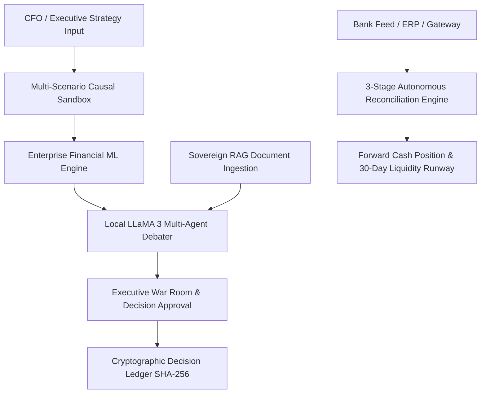

# ⚡ Financial Time Machine (FTM) v2.0.0
> **Autonomous Causal Decision Twin & Multi-Source Reconciliation Platform for Enterprise Finance**

[](https://github.com/jaimiltrived/BUILDTHON-)
[](https://www.python.org/)
[](https://fastapi.tiangolo.com/)
[](https://reactjs.org/)
[](https://www.typescriptlang.org/)
[](https://vitejs.dev/)
[](https://ollama.com/)
[](LICENSE)

**Financial Time Machine (FTM)** is an enterprise-grade, local-first decision simulation and financial intelligence platform designed for CFOs, financial controllers, corporate strategists, and compliance auditors. FTM enables organizations to simulate strategic pricing changes, evaluate cross-functional business impacts, execute multi-source financial reconciliations, run machine learning predictive analytics, and log every decision on a cryptographic SHA-256 tamper-evident ledger—all completely local and sovereign.

Pushed live on remote repository: `https://github.com/jaimiltrived/BUILDTHON-.git`

---

## 🌟 Key Platform Pillars



### 1. ⚡ Multi-Scenario Causal Sandbox
- Test catalog pricing modifications (from -10% to +30%) against empirical customer price elasticity profiles.
- Instantly yields **Pessimistic**, **Base Expected**, and **Optimistic** revenue forecasts, operating profit margins (EBITDA), net cash flow deltas, and projected customer churn rates.
- Interactive simulation parameters allow real-time what-if stress testing before committing changes to production.

### 2. 🏦 Autonomous Multi-Source Financial Reconciliation Engine
- High-throughput **3-stage matching loop** processing Bank Statements vs ERP Invoices vs Payment Gateway feeds (RazorpayX, Stripe, SWIFT).
  - **Stage 1 (Exact Match - 100% Confidence)**: Deterministic UTR reference & exact payment amount resolution.
  - **Stage 2 (Heuristic Fee-Tolerant Match - 98% Confidence)**: Automated net payout resolution considering gateway Merchant Discount Rates (MDR 1.8%–2.2%).
  - **Stage 3 (Cognitive Discrepancy Diagnostics)**: Isolated honest exceptions (TDS Section 194C withholding discrepancies, FX conversion slippage, lump-sum split settlements, gateway fee overcharges).
- **Forward Cash Runway Forecasting**: Computes 30-day liquidity projections considering verified reconciled cash positions vs unapplied liability exposure.

### 3. 📊 Enterprise Financial Machine Learning Engine
- **Cohort Churn Predictor**: 120-tree Random Forest classifier predicting account churn risk calibrated to customer recency, order frequency, AOV, complaint history, and refund ratios ($ROC\text{-}AUC \ge 0.94$).
- **Profit Frontier Optimizer**: Gradient Boosting Regressor modeling non-linear price elasticity curves to solve for the continuous mathematical profit apex ($\Delta P^*$).
- **Cash Flow Forecaster**: Ridge Auto-Regressive model delivering 90-day forward liquidity predictions with 95% confidence intervals.

### 4. 🤖 Local-First Multi-Agent Debater & Sovereign RAG
- Local multi-agent consensus loop: **Financial Observer**, **Risk Guardian**, and **Competitor Benchmarker** debate executive proposals under the leadership of a local **LLaMA 3 Supervisor Agent**.
- Ingest corporate PDF reports, CSV logs, TXT documents, and JSON streams into an in-memory TF-IDF context retriever. Zero telemetry—sensitive financial data never leaves your infrastructure.

### 5. 🛡️ Cryptographic Decision Ledger
- Every simulation run, multi-agent debater transcript, and executive board authorization is appended sequentially to a SHA-256 tamper-evident ledger block.
- Provides compliance auditors with immutable cryptographic audit trails for SOX, ISO 27001, and financial governance checks.

---

## 🎭 Role-Based Access Control (RBAC) Matrix

FTM enforces strict role permissions across enterprise tiers:

| Persona Role | Default Seeded Email | Password | Access Rights & Allowed Capabilities |
| :--- | :--- | :--- | :--- |
| **CFO** | `cfo@nova.com` | `nova123` | Full strategic access: War room creation, simulations, RAG uploads, reconciliation execution |
| **Executive** | `exec@nova.com` | `nova123` | Executive dashboard, pending decision approvals, board sign-offs, financial metrics |
| **Auditor** | `auditor@nova.com` | `nova123` | Read-only access to cryptographic SHA-256 ledger block chain, audit log verification |
| **Business Analyst**| `analyst@nova.com` | `nova123` | Parameter what-if sandbox, risk scoring, ML profit frontier exploration |
| **Org Admin** | `admin@nova.com` | `admin123` | Data batch ingestion, user seat management, organization profile settings |
| **Super Admin** | `superadmin@ftm.com`| `super123` | Platform fleet control, ML model re-training, system-wide configuration |

---

## 📂 Project Architecture & Directory Structure

```
├── backend/                              # FastAPI Backend Application
│   ├── app/
│   │   ├── agents/                      # Multi-Agent prompt templates & Ollama controllers
│   │   ├── analytics/                   # Risk scoring & 3-stage reconciliation engine
│   │   ├── api/                         # REST API routers & dependencies
│   │   │   ├── routers/                 # Endpoints: auth, financial, recon, ml_models, etc.
│   │   │   ├── deps.py                  # OAuth2 / JWT authentication dependency injectors
│   │   │   └── org_utils.py             # Multi-tenant organization scoping helpers
│   │   ├── core/                        # System configuration & JWT security utilities
│   │   ├── ml/                          # Enterprise Financial ML Engine (RandomForest, GBDT, Ridge)
│   │   ├── models/                      # SQLAlchemy & Pydantic database models
│   │   └── simulation/                  # Causal price elasticity calculation modules
│   ├── tests/                           # Pytest & Unittest audit test suites
│   ├── scripts/                         # Database seeding & setup scripts
│   └── main.py                          # Application entrypoint & OpenAPI setup
├── frontend/                             # Vite + React 18 + TypeScript SPA
│   ├── src/
│   │   ├── components/                  # Enterprise UI components
│   │   │   ├── layout/                  # Navigation Header & Sidebar
│   │   │   ├── pages/                   # ReconciliationPage, WarRoomPage, AdminPages, etc.
│   │   │   ├── common/                  # AuditTrail, SkeletonLoader, Badges
│   │   │   ├── AIChat.tsx               # Local LLaMA 3 Sovereign Copilot interface
│   │   │   └── LandingPage.tsx          # Multi-strategy marketing & sandbox landing view
│   │   ├── contexts/                    # AuthContext & Session management state
│   │   └── lib/                         # Axios apiClient & TanStack React Query hooks
├── docs/                                # Technical Architecture & Operational Runbooks
└── README.md                            # Comprehensive Platform Documentation
```

---

## ⚡ Quickstart & Local Setup Guide

### System Prerequisites
- **Node.js**: `v18.0.0` or higher
- **Python**: `3.11` or higher
- **Ollama**: Installed locally ([Download Ollama](https://ollama.com/)). Pull the LLaMA 3 model:
  ```bash
  ollama pull llama3
  ```

---

### 1. Backend Service Setup

```bash
# Navigate to the backend directory
cd backend

# Create and activate a Python virtual environment
python -m venv venv

# On Windows:
venv\Scripts\activate
# On Linux/macOS:
source venv/bin/activate

# Install dependencies
pip install -r requirements.txt

# Configure environment variables
cp .env.example .env

# Seed demo users & database tables
python scripts/seed_demo_users.py

# Start the FastAPI server on port 8001
python -m uvicorn main:app --port 8001 --reload
```

---

### 2. Frontend Application Setup

```bash
# Navigate to the frontend directory
cd frontend

# Install node dependencies
npm install

# Start the Vite development server
npm run dev
```

*The frontend application will launch at `http://localhost:5173` (or `http://localhost:5174` if port 5173 is occupied).*

---

## 📡 Core API Specification Summary

The backend exposes fully documented OpenAPI Swagger endpoints at `http://127.0.0.1:8001/docs`:

| Category | HTTP Method | Endpoint | Description |
| :--- | :--- | :--- | :--- |
| **Auth** | `POST` | `/api/v1/auth/login` | Authenticate user & issue JWT bearer token |
| **Auth** | `GET` | `/api/v1/auth/me` | Fetch current authenticated user profile & role |
| **Financial**| `GET` | `/api/v1/financial/summary` | Retrieve executive financial metrics & KPI totals |
| **Simulations**| `POST` | `/api/v1/simulations/run` | Execute multi-scenario causal elasticity simulation |
| **Reconciliation**| `GET` | `/api/v1/reconciliation/run` | Execute 3-Stage autonomous matching loop & cash forecast |
| **Reconciliation**| `POST` | `/api/v1/reconciliation/ai-analyze` | Trigger local LLaMA 3 cognitive discrepancy analysis |
| **ML Models** | `POST` | `/api/v1/ml/churn-predict` | Predict cohort churn probability using Random Forest |
| **ML Models** | `POST` | `/api/v1/ml/optimize-price` | Solve profit-maximization curve via Gradient Boosting |
| **War Room** | `GET` | `/api/v1/war-room/decisions` | Fetch executive war room proposal list & votes |
| **Ledger** | `GET` | `/api/v1/ledger/blocks` | Fetch cryptographic SHA-256 audit blocks |
| **AI Copilot**| `POST` | `/api/v1/ai/chat` | Query local LLaMA 3 multi-agent supervisor |

---

## 🧪 Verification & Testing Suite

Run the automated backend test suite to verify DB schemas, authentication scopes, ML engines, and reconciliation pipelines:

```bash
# Activate virtualenv and run unittest suite
cd backend
python -m unittest discover tests
```

---

## 📄 License & Attribution

Distributed under the **MIT License**. Created by the Financial Time Machine Engineering Team.
