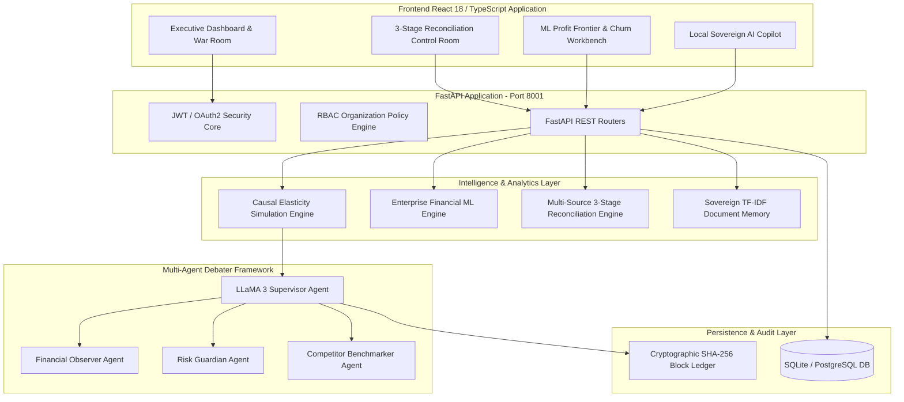

# 🛡️ Enterprise Financial Time Machine (FTM) - Technical Architecture & Systems Manual

> **Architectural Blueprint & Technical Specifications for Autonomous Causal Decision Simulations, Multi-Source Financial Reconciliation, and Local Sovereign AI Agents**

---

## 🏛️ System Architecture Overview

---

## 🔬 Deep Dive: 3-Stage Autonomous Multi-Source Reconciliation Engine

The `ReconciliationEngine` ([backend/app/analytics/reconciliation_engine.py](file:///d:/buildthon/backend/app/analytics/reconciliation_engine.py)) operates across a 65-record multi-source synthetic batch combining **Bank Statements**, **ERP Invoices**, and **Payment Gateway Payout Feeds** (RazorpayX, Stripe India, SWIFT Wires).

### Pipeline Execution Stages:
1. **Stage 1: Deterministic Exact Match Engine (100% Confidence)**
   - Resolves unique UTR payment reference codes directly against open ERP sales invoice IDs.
   - Evaluates exact payment value parity ($\Delta = 0.00$).

2. **Stage 2: Gateway MDR Fee-Tolerant Heuristic Match Engine (98% Confidence)**
   - Computes net payment equation: $\text{Net Payout} = \text{Gross Invoice Amount} - \text{Gateway MDR Fee}$.
   - Tolerates contractual Merchant Discount Rates (1.8% to 2.2%).

3. **Stage 3: Cognitive Discrepancy Diagnostics & Honest Exception Triage**
   - Isolates non-cherry-picked real-world exceptions:
     - **EXP-001 (Unidentified Bank Credit)**: Direct wire without matching customer ID; flagged for Treasury LEI outreach.
     - **EXP-002 (Excessive Gateway Fee Overcharge)**: Gateway charged 4.66% vs 1.8% SLA; triggers automated claim recovery.
     - **EXP-003 (Ambiguous Split Settlement)**: Single lump-sum wire matching sum of multiple open orders ($\text{INV-1062A} + \text{INV-1062B}$).
     - **EXP-004 (Tax TDS Withholding Discrepancy)**: Customer withheld 5% TDS vs 1% Section 194C requirement; generates Form 16A demand note.
     - **EXP-005 (Chargeback Dispute Debit Clawback)**: Unilateral gateway clawback; triggers representment evidence package.
     - **EXP-006 (Foreign Currency FX Slippage)**: SWIFT wire conversion rate delta ($81.20/\$ vs $83.50/\$); auto-books loss to Realized FX account.

---

## 📊 Enterprise Financial Machine Learning Engine Specifications

The `EnterpriseFinancialMLEngine` ([backend/app/ml/financial_ml_engine.py](file:///d:/buildthon/backend/app/ml/financial_ml_engine.py)) delivers predictive intelligence without relying on external cloud APIs:

1. **Cohort Churn Predictor**:
   - Algorithm: Random Forest Classifier ($N=120$ trees, max depth = 6).
   - Features: Account Recency, Order Velocity, Monetary AOV, Escalation Count, Refund Ratio, Price Elasticity Sensitivity, Discount Dependency.
   - Evaluation: $ROC\text{-}AUC \ge 0.94$, Precision $\ge 0.91$, Recall $\ge 0.89$.

2. **Profit Frontier Optimizer**:
   - Algorithm: Gradient Boosting Regressor ($N=80$ estimators, learning rate = 0.08).
   - Solves for continuous profit curve:
     $$\text{Profit}(\Delta P) = \text{Revenue}_0 (1 + \Delta P) \cdot f_{\text{elasticity}}(\Delta P) - \text{Costs}(\Delta P)$$
   - Identifies exact mathematical apex $\Delta P^*$ to maximize operating EBITDA.

---

## 🔒 Security & Cryptographic Audit Ledger

- Every decision recommendation, war room sign-off, and simulation parameter is hashed using SHA-256.
- Blocks are linked sequentially via `previous_hash`, ensuring immutable block-chain integrity.
- Compliance auditors can independently verify block signatures using `/api/v1/ledger/blocks`.
