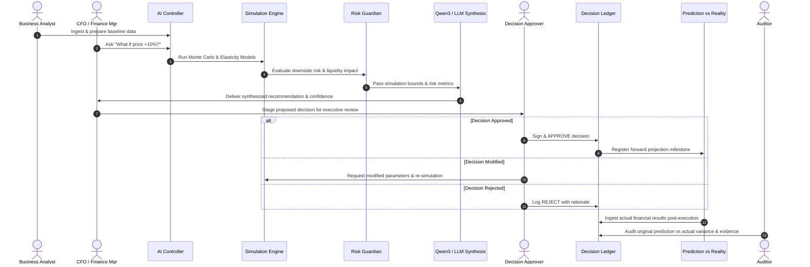

# User Roles & RBAC Architecture Specification
## Financial Time Machine / Hybrid Financial Intelligence System

---

## 1. Executive Summary & Philosophy

In the **Financial Time Machine (Hybrid Financial Intelligence System)**, users interact with predictive simulation engines, multi-agent AI synthesizers, and cryptographic decision ledgers. 

To maintain enterprise security, auditability, and clarity without role bloat, the system defines **6 Human User Roles** across **4 Distinct Layers**, while treating the **AI Engine as an autonomous System Actor** rather than a human user role.

```
┌─────────────────────────────────────────────────────────────┐
│ 1. Platform Level: Super Admin                             │
├─────────────────────────────────────────────────────────────┤
│ 2. Organization Level: Organization Admin                  │
├─────────────────────────────────────────────────────────────┤
│ 3. Financial Intelligence: CFO / Finance Manager, Analyst   │
├─────────────────────────────────────────────────────────────┤
│ 4. Decision Governance: Decision Approver, Auditor          │
└─────────────────────────────────────────────────────────────┘
                              ▲
                              │ Coordinates with
                              ▼
┌─────────────────────────────────────────────────────────────┐
│ 5. AI System Actors (Supervisor, Observer, Simulator, etc.) │
└─────────────────────────────────────────────────────────────┘
```

---

## 2. User Roles Breakdown

### 1. 🔐 Super Admin (Platform Owner)
- **Scope**: Entire multi-tenant platform.
- **Key Responsibilities**:
  - Provision and manage organizations/tenants.
  - Monitor global AI cluster health (Ollama / Qwen3, Vector DB, Redis).
  - Review platform-wide telemetry and global system audit logs.
  - Manage global LLM routing configurations and rate limits.

### 2. 🏢 Organization Admin (Tenant Administrator)
- **Scope**: Single organization boundary (`organization_id`).
- **Key Responsibilities**:
  - Manage company workspace, users, and assign internal roles.
  - Configure data ingestion pipelines and ERP/accounting connectors.
  - Manage departmental scopes and data access controls.
  - View organization-level resource usage and audit history.

### 3. 💰 CFO / Finance Manager (Primary Financial Operator)
- **Scope**: Organization financial strategy and simulation triggers.
- **Key Responsibilities**:
  - Formulate strategic "What-If" inquiries (e.g., pricing, OPEX, hiring, marketing).
  - Interact with AI Controller and review Multi-Agent risk & reward synthesis.
  - Create, adjust, and stage decisions.
  - Review prediction vs. reality feedback loops and calibrated confidence bounds.

### 4. 📊 Business Analyst (Scenario Modeler)
- **Scope**: Analytical research and exploratory simulations.
- **Key Responsibilities**:
  - Run multi-parameter scenario comparisons (Scenario A vs. B vs. C).
  - Deep-dive into customer elasticity, unit economics, and churn dynamics.
  - Prepare empirical simulation dossiers for executive review.
  - *Constraint*: Can model and stage simulations, but lacks final binding decision execution authority.

### 5. 👔 Decision Approver / Executive (Executive Governance)
- **Scope**: Strategic sign-off and capital commitment.
- **Key Responsibilities**:
  - Review streamlined **Executive War Room** alerts.
  - Inspect AI recommendation confidence, downside risk thresholds, and scenario delta.
  - Execute binding **APPROVE**, **REJECT**, or **MODIFY & RE-SIMULATE** actions.
  - Seal decisions into the tamper-proof Decision Ledger.

### 6. 🔎 Auditor (Compliance & Explainability)
- **Scope**: Read-Only Forensic Analysis.
- **Key Responsibilities**:
  - Inspect full decision provenance: inputs, agent traces, LLM rationale, confidence scores.
  - Verify cryptographic timestamps and approver identities in the Decision Ledger.
  - Audit post-hoc outcome variance (Prediction vs. Reality).
  - Export compliance and regulatory explainability reports.

---

## 3. Role-Based Permission Matrix (RBAC)

| Feature / Action | Super Admin | Org Admin | CFO / Finance Mgr | Business Analyst | Executive Approver | Auditor |
| :--- | :---: | :---: | :---: | :---: | :---: | :---: |
| **System Dashboard & Telemetry** | ✅ | ❌ | ❌ | ❌ | ❌ | ❌ |
| **Organization Management** | ✅ (All) | 🏢 (Own) | ❌ | ❌ | ❌ | ❌ |
| **User & Role Assignment** | ✅ (Global) | 🏢 (Own) | ❌ | ❌ | ❌ | ❌ |
| **Financial Dashboard** | ✅ | ✅ | ✅ | ✅ | ✅ | 👁️ (Read-only) |
| **AI Controller & Chat** | ✅ | ✅ | ✅ | ✅ | ✅ | 👁️ (Read-only) |
| **What-If Simulation Engine** | ✅ | ✅ | ✅ | ✅ | 👁️ (Read-only) | 👁️ (Read-only) |
| **Risk Guardian & Stress Testing**| ✅ | ✅ | ✅ | ✅ | ✅ | 👁️ (Read-only) |
| **AI Recommendations** | ✅ | ✅ | ✅ | ✅ | ✅ | 👁️ (Read-only) |
| **Stage / Draft Decision** | ❌ | ❌ | ✅ | ✅ | ✅ | ❌ |
| **Approve / Reject Decision** | ❌ | ❌ | ⚙️ (Tier 1) | ❌ | ✅ (Tier 2/3) | ❌ |
| **Modify & Re-simulate** | ❌ | ❌ | ✅ | ✅ | ✅ | ❌ |
| **Decision Ledger Access** | ✅ | ✅ | ✅ | 👁️ (Read-only) | ✅ | 👁️ (Read-only) |
| **Prediction vs. Reality Tracking**| ✅ | ✅ | ✅ | ✅ | ✅ | 👁️ (Read-only) |
| **AI Memory & Learning Store** | ✅ | ✅ | ✅ | 👁️ (Read-only) | 👁️ (Read-only) | 👁️ (Read-only) |
| **Audit Logs & Trace History** | ✅ (System) | 🏢 (Org) | 👁️ (Read-only) | 👁️ (Read-only) | 👁️ (Read-only) | ✅ (Full Trace) |
| **AI Infrastructure Config** | ✅ | ❌ | ❌ | ❌ | ❌ | ❌ |
| **Data Import / Sync Pipelines** | ✅ | ✅ | ✅ | ✅ | ❌ | ❌ |
| **Export Reports & Dossiers** | ✅ | ✅ | ✅ | ✅ | ✅ | ✅ |

*Legend: `✅ Full Access` | `🏢 Scope to Own Org` | `👁️ Read-Only View` | `⚙️ Configurable Threshold` | `❌ No Access`*

---

## 4. End-to-End Core Workflow



---

## 5. System Actors vs. Human Users Separation

To maintain architectural purity:

- **Human Roles** (Super Admin, Org Admin, CFO, Analyst, Executive, Auditor) authenticate via JWT tokens and possess credentials.
- **AI System Actors** run as orchestrated services inside the backend agent runtime:
  1. **Supervisor Agent**: Orchestrates multi-agent execution pipeline.
  2. **Financial Observer Agent**: Analyzes historical financial metrics and anomalies.
  3. **Simulation Agent**: Runs stochastic mathematical models (Monte Carlo, elasticity, cash flow forecasting).
  4. **Risk Guardian**: Evaluates tail-risk (VaR, stress test, debt covenant limits).
  5. **Recommendation Engine / Qwen3 Layer**: Synthesizes multi-model outputs into human-readable strategic advisory text.

---

## 6. Implementation Schema Mapping

### Backend Enum (`app/models/user.py`)
```python
class RoleEnum(str, enum.Enum):
    SUPER_ADMIN = "SUPER_ADMIN"
    ORG_ADMIN = "ORG_ADMIN"
    CFO = "CFO"
    BUSINESS_ANALYST = "BUSINESS_ANALYST"
    EXECUTIVE = "EXECUTIVE"
    AUDITOR = "AUDITOR"
```

### FastAPI Dependency Guard (`app/api/deps.py`)
```python
class RoleChecker:
    def __init__(self, allowed_roles: list[RoleEnum]):
        self.allowed_roles = allowed_roles

    def __call__(self, user: User = Depends(get_current_active_user)):
        if user.role not in self.allowed_roles:
            raise HTTPException(
                status_code=status.HTTP_403_FORBIDDEN,
                detail="Operation not permitted for user role"
            )
        return user
```
